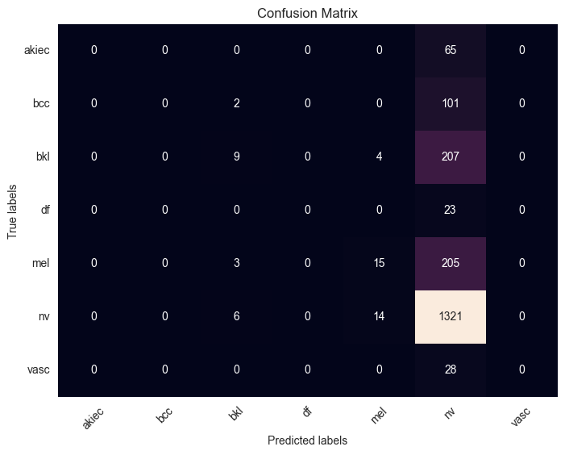
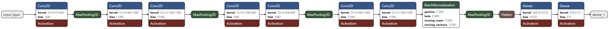
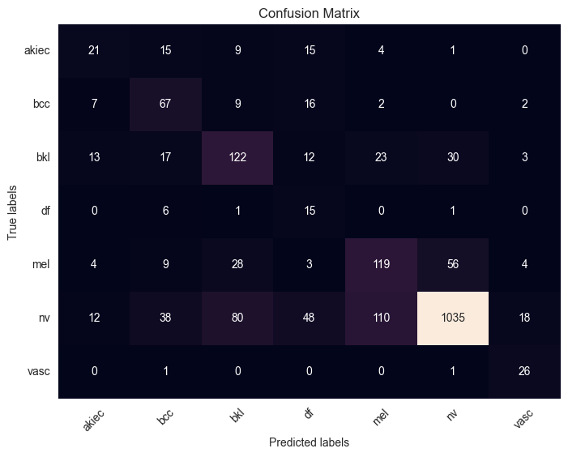
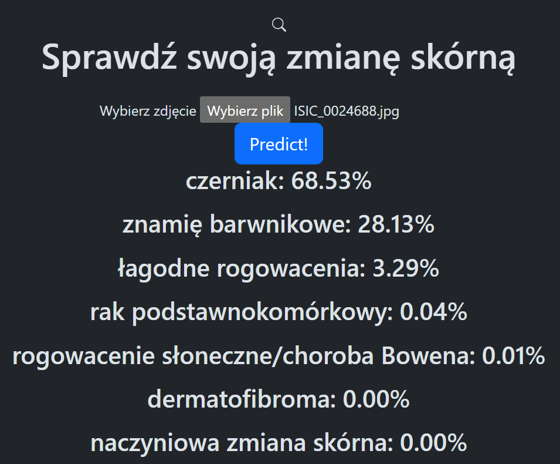

# Skin cancer prediction
## Table of contents: 
* [General info](#general-info)
* [Data preparation and analysis](#data-preparation-and-analysis)
* [Machine Learning](#machine-learning)
* [Deep Learning](#deep-learning)
* [Final Model](#final-model)
* [Web Application](#web-application)
* [Requirements](#requirements)
* [Setup](#setup)
* [Citation](#citations)

### General info
The aim of this project is to create a simple web application using Flask for deploying a Convolutional Neural Network (CNN) model that classifies skin lesions into 7 different categories. This project focuses on building the most accurate Keras Sequential model without using transfer learning for better understanding neural networks and their learning process. The web app is designed to be as user-friendly and straightforward as possible.
The dataset used in this project is obtained from [here](https://dataverse.harvard.edu/dataset.xhtml?persistentId=doi:10.7910/DVN/DBW86T).
### Data preparation and analysis
1. Metadata analysis.
2. Categories to which lesions are classified are listed below:
   * nv - melanocytic nevi
   * mel - melanoma
   * akiec - actinic keratoses and Bowen's disease
   * bcc - basal cell carcinoma
   * bkl - benign keratosis-like lesions
   * df - dermatofibroma
   * vasc - vascular lesions
### Machine Learning
... in progress ...
### Deep learning
Chosen neural network: CNN
1. Creation of a simple model architecture in order to see how it performs on extremely imbalanced dataset. 
   * high accuracy already at the begging 
   * extremely low 'recall' and 'F1-score' values
   * model predicts almost all lesions to be 'nv' (major class)
   


2. Adding class weights while training -> really low accuracy
3. Balance train data - usage of RandomOverSampler and RandomUnderSampler in order to have 1000 samples of each class
4. Trying different model architectures. 
5. Saving the best model found while searching for best values of hyperparameters using KerasTuner(creation of the class CNNHyperModel that inherits from HyperModel).
6. Cloning the architecture of bets model, fits train data to it, make use of callbacks (early stopping if model's accuracy on validation data does not improved since 8 epochs).
7. Final evaluation of the model.
8. Saving final model (.keras format)
### Final Model
Model architecture:

Confusion matrix:



Accuracy: 70%
### Web Application
Web app is written in Flask and enables user to upload his own photo with skin lesion and get the prediction as a list of percentages of belonging to each classes in descending order. As this project is for university studies text on the website is in polish.



* Back-end: Flask
* Front-end framework(CSS + JavaScript): Boostrap v5.3
* Dynamic operations (uploading images and ajax): JavaScript: jQuery 3.6.0 minified version
### Requirements
* Python 3.11+
* As each part (data analysis, data modelling and app) could be explored separately, for each part is created file 'requirements.txt' that contains a list of packages or libraries needed to work on selected part
* 'requirements.txt' outside listed part directories contains packages needed for all parts
### Setup
1. First, clone this repository and go into it.
   ```sh
   git clone https://github.com/natix-x/Skin-cancer-prediction.git
   ```
   ```sh
   cd Skin-cancer-prediction
   ```
2. To work with data analysis and data modeling parts [download](https://dataverse.harvard.edu/dataset.xhtml?persistentId=doi:10.7910/DVN/DBW86T) and extract the dataset in 'DATA' directory as shown below:
   ```
     DATA/
    ├── HAM10000_images_part_1_and_2
    │   ├── ISIC_00000000.jpg
    │   └── 
    └── HAM10000_metadata
   ```
   Place all images into 'HAM10000_images_part_1_and_2' directory.
3. For just exploring web app:
   * for Windows users:
    ```sh
    RunApp.bat
   ```
   * for Linux or macOS users:
   ```sh
    chmod +x venv_setup.sh run_app.sh
   ```
   ```sh
    ./run_app.sh
   ```
### Citations
Tschandl, Philipp, 2018, "The HAM10000 dataset, a large collection of multi-source dermatoscopic images of common pigmented skin lesions", https://doi.org/10.7910/DVN/DBW86T, Harvard Dataverse, V4, UNF:6:KCZFcBLiFE5ObWcTc2ZBOA== [fileUNF]


